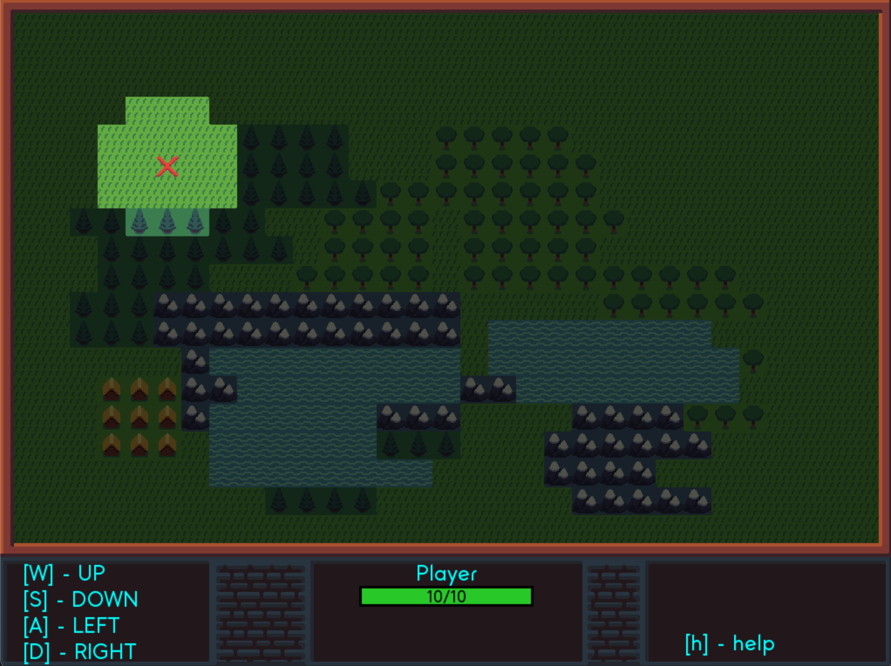

# RPG D&D game template



## Disclaimer

Main code base is taken from Adrian (Ork Slayer Gamedev):

[GitHub Repo](https://github.com/orkslayergamedev/roguelike-ascii-vs-pygame)

check out his great [YT](https://www.youtube.com/@orkslayergamedev/) tutorials!

Play [online](https://hubertnafalski.itch.io/rpg-dd-game-template) - no installation needed 🚀

## Features

* transparent sprites (player)
* automatic/procedural map generation (simple patch system with some randomization)
* several enemies with different weapons (no sprites yet)
* map scrolling
* fog of war
* simple collision detection (only grassland is walkable)
* runs in desktop and in web browser as well (thanks to [pygbag](https://pygame-web.github.io/) lib)

## TODO

* enemy sprites
* touchscreen controls
* custom pygbag template
* fix fullscreen mode Web browser ([f] key)

## Installation

```bash
# create venv
python -m venv .venv
# activate venv
source .venv/bin/activate # on Linux/MacOS
# or
.venv\Scripts\activate # on Windows
# install packages
pip install -r requirements.txt
```

## Running

Desktop mode:

```bash
cd game
python main.py
```

*** 

Browser mode:

```bash
# from top level project folder
pygbag game
```

open [http://localhost:8000/]() in browser

use [http://localhost:8000#debug]() to show terminal in browser - useful for troubleshooting

## Deploying

### To [itch.io](itch.io)

full instruction [here](https://pygame-web.github.io/wiki/pygbag/itch.io/)

```bash
pygbag --archive game
```

upload build/web.zip to [itch.io](itch.io)

***

### To GitHub pages

full instruction [here](https://pygame-web.github.io/wiki/pygbag/github.io/)
